# Shop App

This is my first MVC app written in PHP with Laravel framework as an assignment for my Web Application Programming
classes. Some things I used worth mentioning:

- dependency injection for services
- many-to-many relationships
- fetch API calls for adding items to basket and changing their quantity while in basket for better user experience

As for the web design I used Bootstrap 5. It is a fully responsive website.

## Preview:

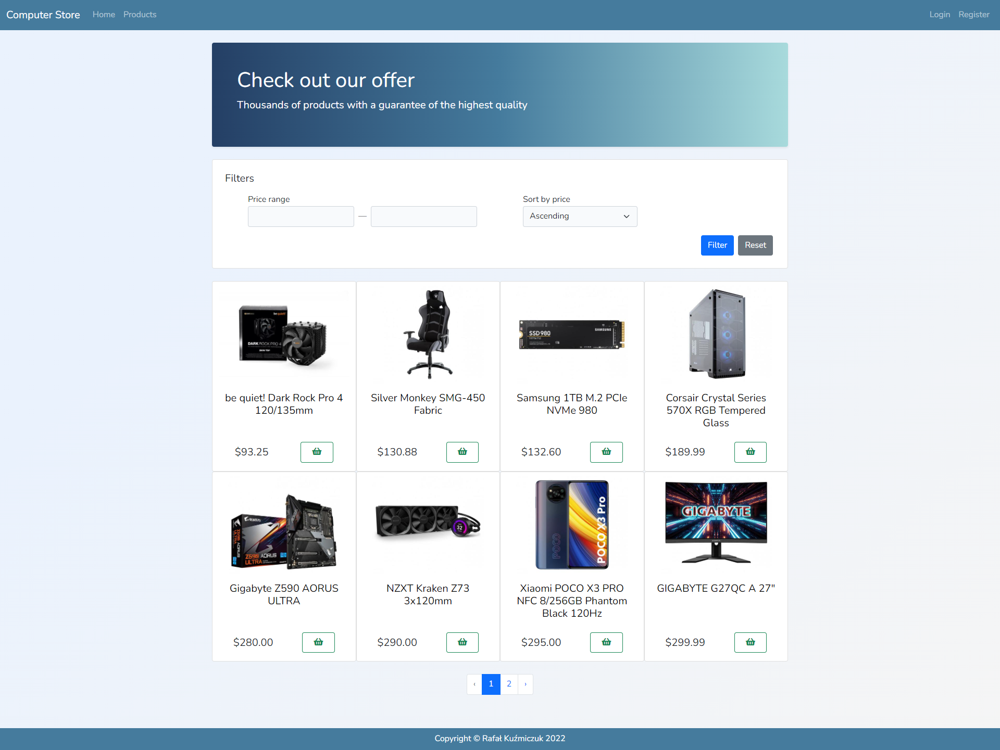

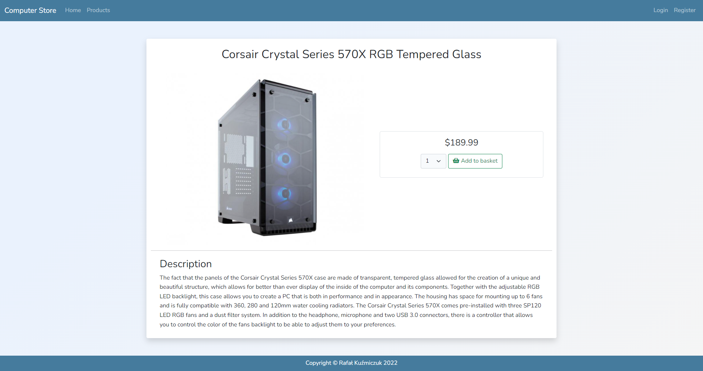

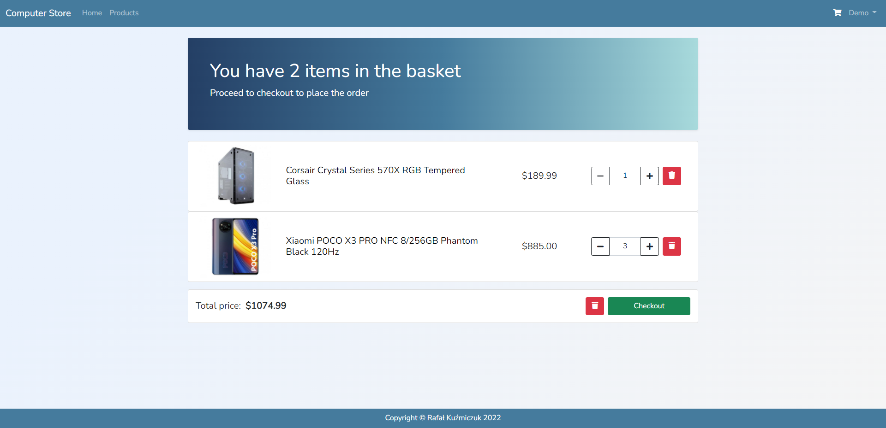

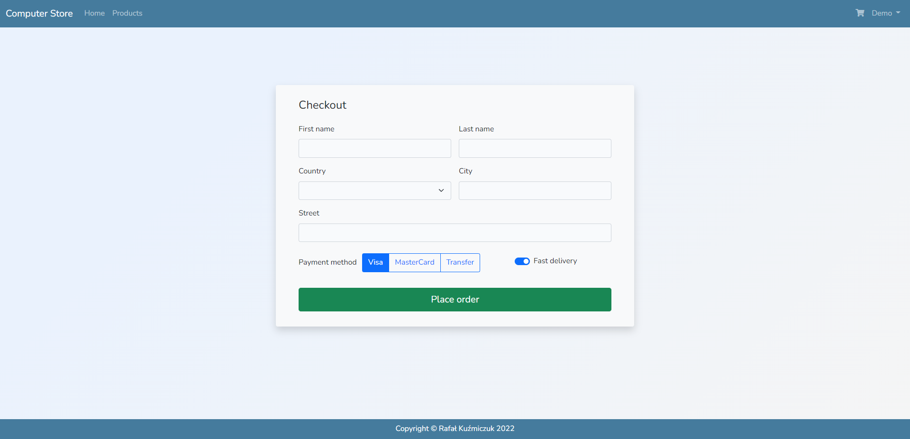

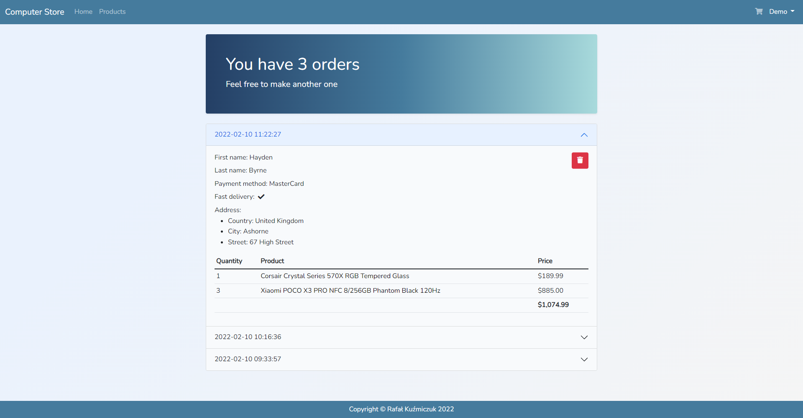

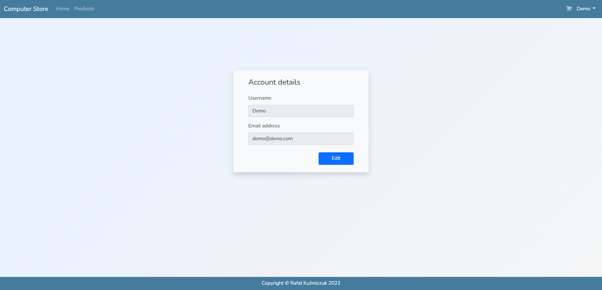

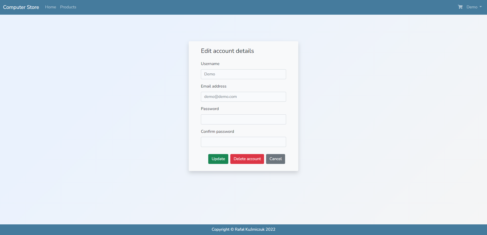

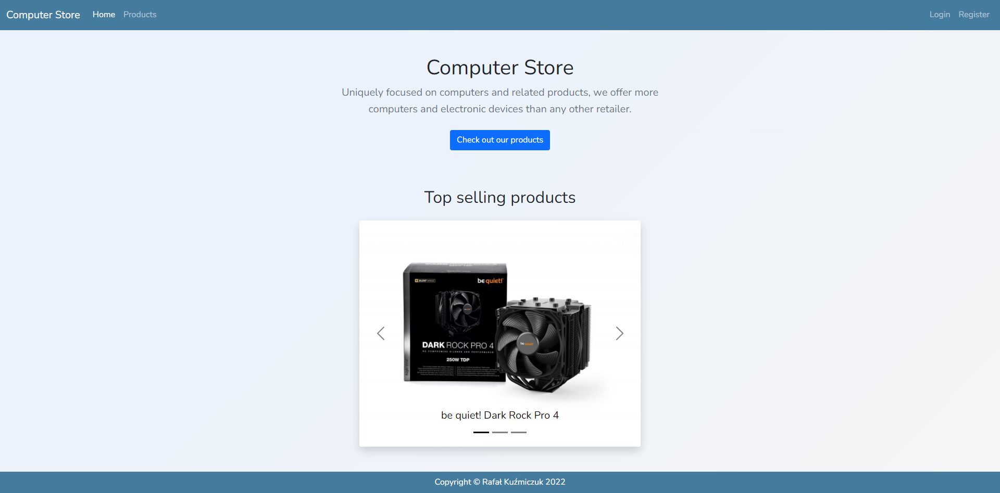

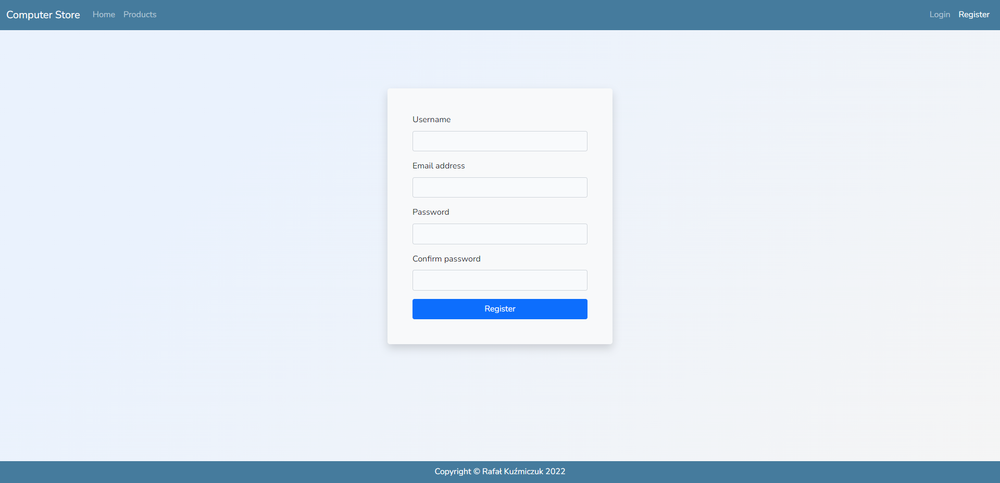

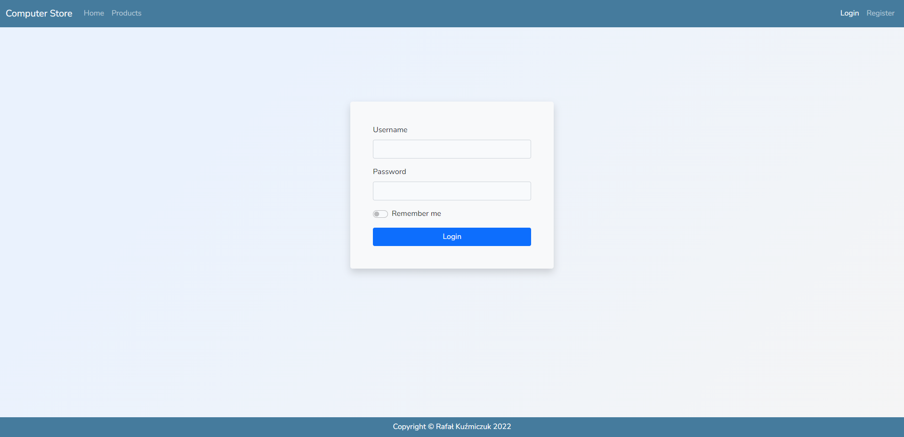

## Database schema:

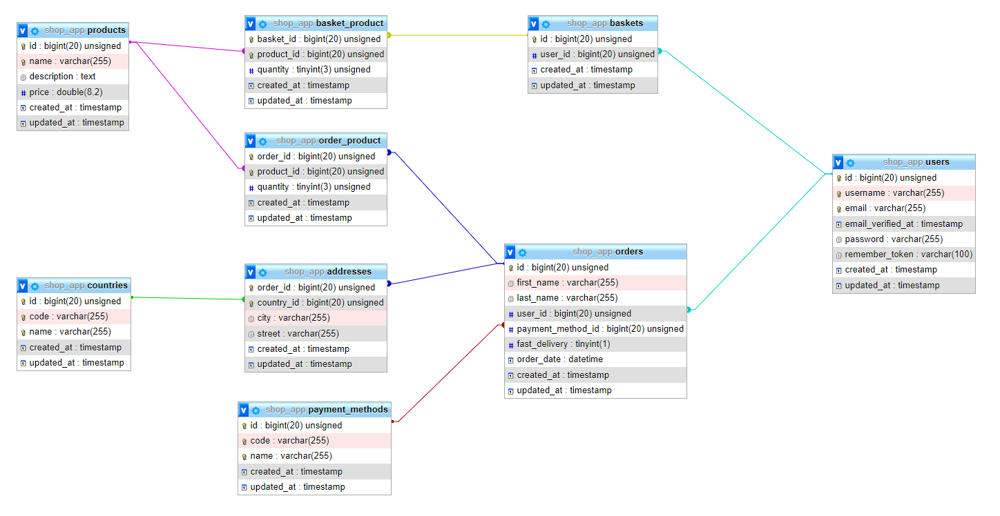
